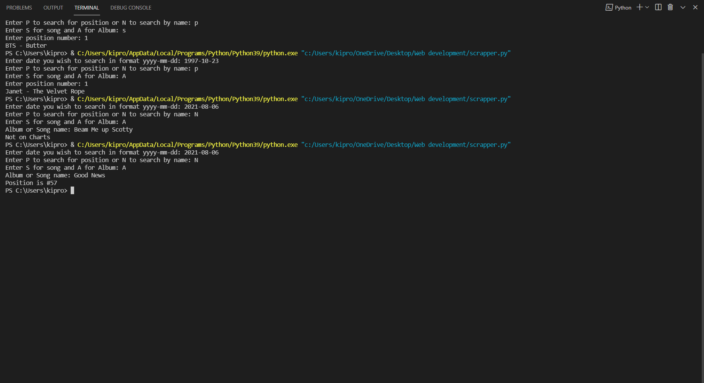

# Billboard web scrapper
## Motivation for project
I love music and analyzing charts which is the main reason for doing this project.
I love keeping up with charts from Billboard to rollingstone and even spotify charts and therefore wanted to be able to quickly check chart positions for my favorite songs or albums currently
or even analyze charts dating back to ten years ago.
This is a web scrappping project that utilizes requests and the beautiful soup package.

## How it works
* User is prompted to enter date (yyyy-mm-dd) to determine which chart date our program will get information from
* User is prompted to choose whether they want to see Songs or Albums charts to determine if we will get information from Billboard HOT 100 or Billboard 200
* User is prompted to enter the Album or Song name
* The program proceeds to get the appropriate parts of the content recoverd that is the name of the song or album and the chart position
* If found the chart postion is returned if not user gets message "Not on Charts"

## Illustration

